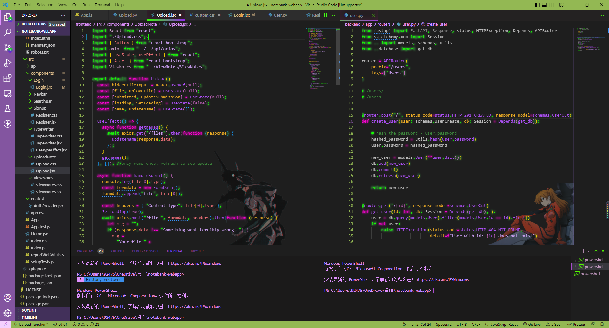

# README

An improved version of EVA 01 theme, better on the eyes and more accurate color combination

source code https://github.com/KingJacM/eva-unit-01-theme

feel free to pull request/start issue

Note: neon and background is implemented with two other extension, **you can change/display the background with personal preference**. Add the following code to the settings.json after downloading *Background* and *vscode_custom_css* extensions. 
```
"background.useDefault": false,
    "background.customImages": [
        "<your background image url>",
        "<your background image url>"
    ],
    "background.styles": [
        {
            "content": "''",
            "pointer-events": "none",
            "position": "absolute",
            "z-index": "99999",
            "width": "100%",
            "height": "100%",
            "background-position": "70% 100%",
            "background-repeat": "no-repeat",
            "background-size":"30%",
            
            "opacity": 0.45
        },
        {
            "content": "''",
            "pointer-events": "none",
            "position": "absolute",
            "z-index": "99999",
            "width": "100%",
            "height": "100%",
            "background-size": "60%",
            "background-position": "60% 100%",
            "background-repeat": "no-repeat",
            "opacity": 0.45
        }
    ],
    "background.useFront": false,
    "background.loop": true,
    // ================================================
    "vscode_custom_css.imports": [
        "<your css url>"
    ],
    
```

Neon CSS:https://github.com/robb0wen/synthwave-vscode/blob/master/synthwave84.css

To change some color based on your own preference, see https://code.visualstudio.com/api/extension-guides/color-theme and some other tutorials on internet.
